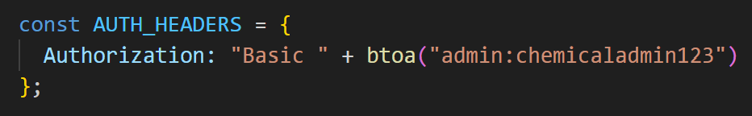
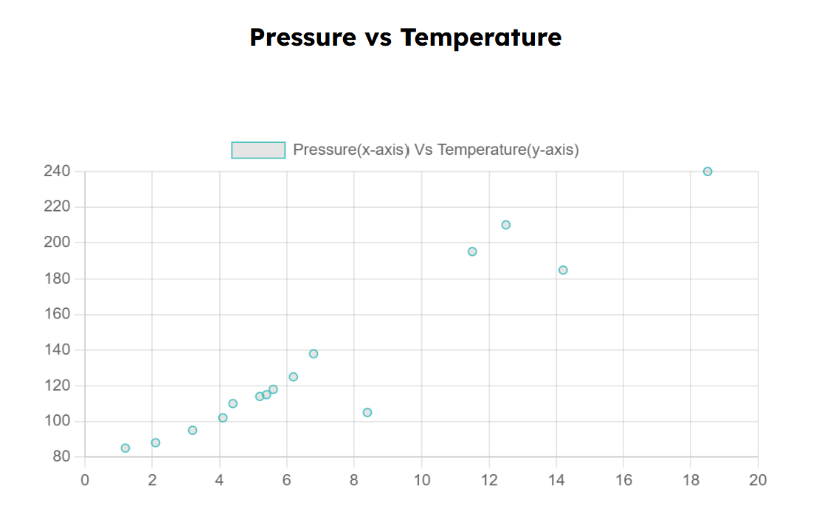
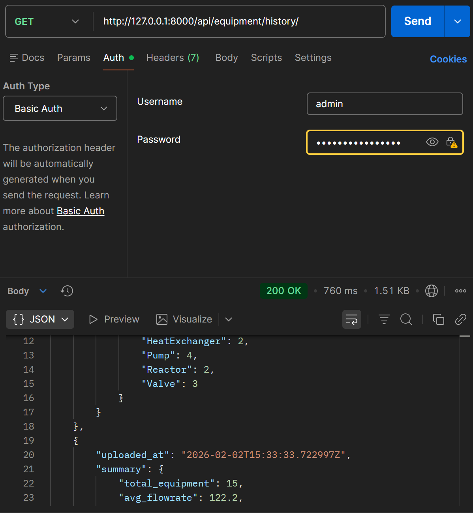

# 🧪 Chemical Equipment Analytics System

This is a  full-stack analytics application that allows users to upload CSV data of chemical equipment parameters, visualize insights through charts, and generate simple downloadable PDF reports.

This project demonstrates:

* Strong backend API design
* Frontend data visualization
* Authentication
* A simple desktop application

A unified **Django backend** serves both the **web** and **desktop** applications.

---

## 🚀 Features

* Upload CSV files containing equipment data
* Automatic data validation and processing
* Summary analytics (averages, counts)
* Interactive charts using Chart.js
* Simple PDF report generation
* View last 5 datasets and summaries using Postman
* Basic Authentication using Django REST Framework

---

## 🌐 Supported Platforms

* 🌍 **Web Frontend** (React)
* 🖥 **Desktop Application** (PyQt5)

---

## 🛠 Tech Stack

### Backend

* Python
* Django
* Django REST Framework
* SQLite
* Pandas
* ReportLab (PDF generation)

### Frontend

* React
* Chart.js
* HTML, CSS

### Desktop App

* Python
* PyQt5
* Matplotlib
* Requests

---

## 📁 Project Structure

```
backend/
├── equipment/
├── manage.py

frontend/
├── src/
├── public/

desktop_app/
├── desktop_app.py

README.md
```

---

## ⚙️ Setup

### Backend (Django)

```bash
cd backend
python -m venv venv
venv\Scripts\activate   # Windows
pip install -r requirements.txt
python manage.py migrate
python manage.py runserver
```

### Frontend (React)

```bash
cd frontend
npm install
npm start
```

### Desktop App

```bash
cd desktop_app
python desktop_app.py
```

---

## 🔐 Important Note: Authentication

This project uses **Basic Authentication** for API access.

* Valid credentials must be sent in request headers
* Used for development and simplicity
* You will receive **401 Unauthorized** if credentials are missing



**Example:**

* Username and password passed via Authorization header (Basic Auth)

---

## 🔌 API Overview

* RESTful APIs built using Django REST Framework
* Handles equipment data operations
* Supports CSV-based ingestion
* Designed for web & desktop consumption

---

## 🔄 Main Workflow

1. Upload a valid CSV file
2. Django parses the data
3. Pandas calculates analytics
4. Data is stored in SQLite

---

## 📊 Visualizations

* **Web App:** Chart.js (rich interactive visuals)
* **Desktop App:** PyQt5 + Matplotlib (limited by framework)


---

## 📄 PDF Report

* Simple PDF report is generated
* Downloadable after CSV processing

---

## 🕒 History Management

* View last 5 uploaded datasets using Postman
* Includes timestamps and summary data



---

## 📬 Contact

**Abhijith AC**
📧 [acabhijith13@gmail.com](mailto:acabhijith13@gmail.com)

---


---


